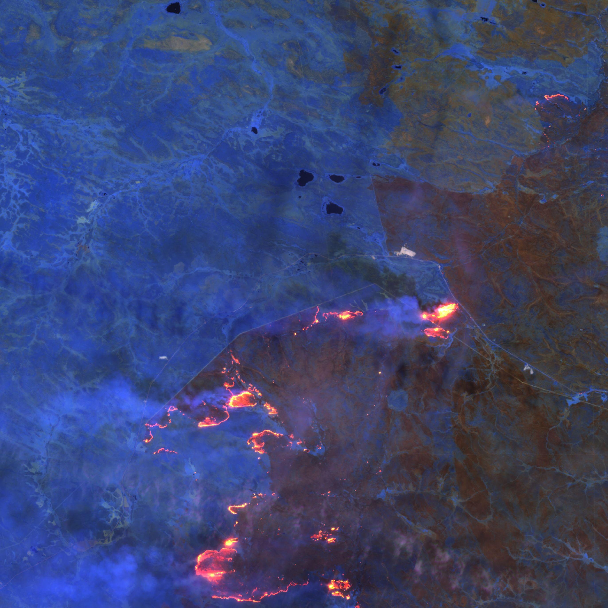
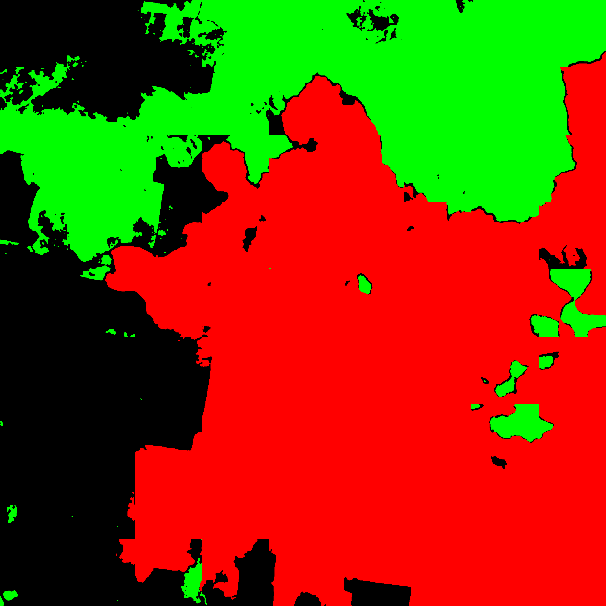

# Wildfire-detection-and-its-spead-prediction

## Introduction
We have detected wilfires in a region using sattelite imagery. The dataset we used was taken from
sentinel sattelite (a satellite of European Space Agency under Copernicus Programme). We have
used the dataset of the Australian Bushfires of 2019-20.
## Approach
1. We first preprocessed the raw data from the sentinel satellite. We used libraries like gdal, open cv,
PIL and numpy for preprocessing.
2. In preprocessing we calculated the range input signals for individual bands in the data using
histogram and interpolated that range from 0 to 255 for further processing. We divided the image
into 16 parts.
3. We created the labels for image segmentation training manually. We created three classes for
vegetation area, burned area and other areas.
4. For segmentation we first divided the images into 300X300 blocks and then we classified the
blocks into three classes using CNN.These classes were:
1. Completely burned
2. Completely unburned
3. Blocks with mixed regions(both burned and unburned areas)
5. Using UNET we applied segmentation on blocks that were predicted mixed by the CNN. We had
tried many different band combinations, models and transfer learning approaches.
6. After classification and segmentation, we combined the outputs of both these models into final
segmented masks.

## Files
1. ***calc_thresholds.ipynb:***
    This file will iterate over all files and calculate thresholds to be used for preprocessing. It will store thresholds to *band_thresholds.json*

2. ***preprocessing.ipynb:***
    This file is used to convert the raw SENTINEL-2 data to processed png files. 
    Preprocessing include opening the jp2 image files for different bands using gdal library,
    finding the correct range of data to be interpolated to 0 to 255 brighness levels of image.
    The input images are divided into 16 images to reduce the resolution for further processing

3. ***cnn_clasification.ipynb:***
    This file is used to train CNN based classifier to classify the 300x300 patches on the input 
    images into 3 classes: patches that have completely burned area, completely unburned vegetation 
    and patches that contain mixed area (both burned, unburned or other)

4. ***unet_segmentation.ipynb:***
    This file is used to train UNET based segmentaion model to segment the 300x300 patches from 
    mixed class of cnn_clasification to burned area, unburned area, and other areas (residence, 
    rivers, cloud covered, etc)

5. ***predict.ipynb:***
    This file use trained models from cnn_clasification and unet_segmentation and output predictions
    combined to one image file for given tile_id and tile_no (0 to 15 from preprocessing.ipynb)

6. ***all_data_predict.ipynb:***
    This file is used to iterate over all image files, segment the data and save them.

7. ***classify_mask.ipynb:***
    Divide label masks and bands images to patches 

## Data source used
201911_Wildfire_AUS dataset from https://hddsexplorer.usgs.gov/  
Model weights: https://drive.google.com/drive/folders/1cx88n_j9XkkOYfIMtQ7rPZtYMffd0kAi?usp=share_link  

## Sample outputs
 
 

 
 

 